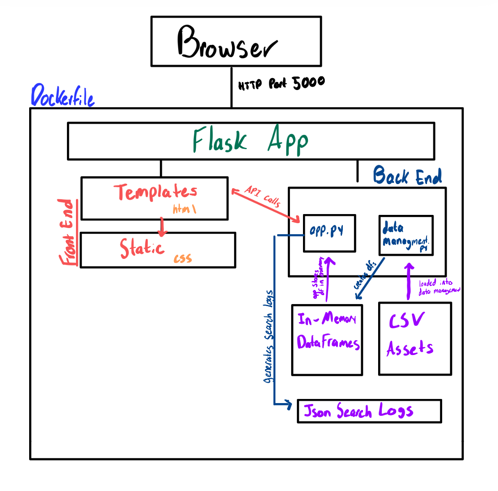
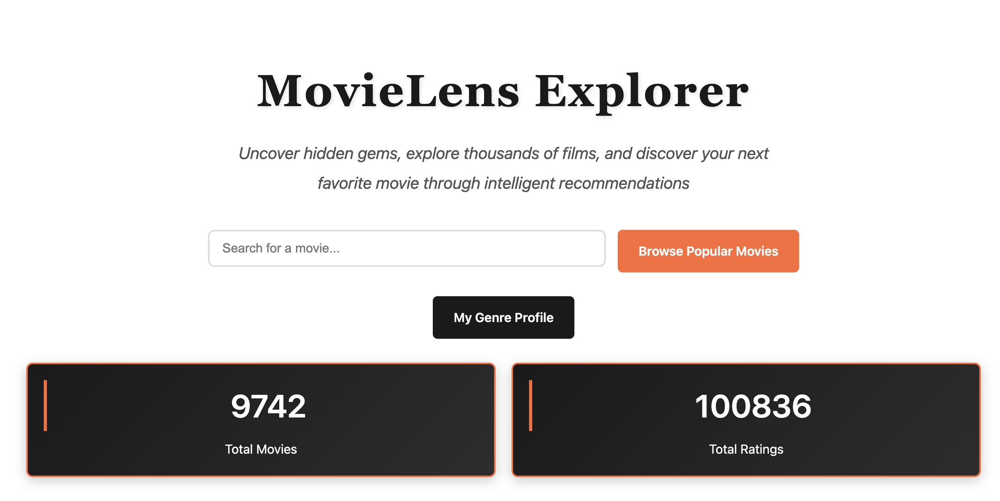
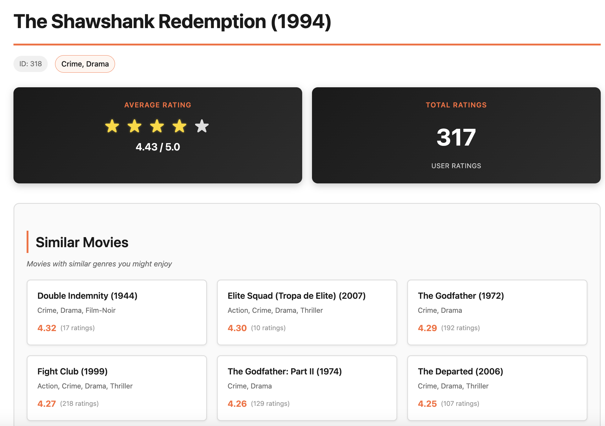
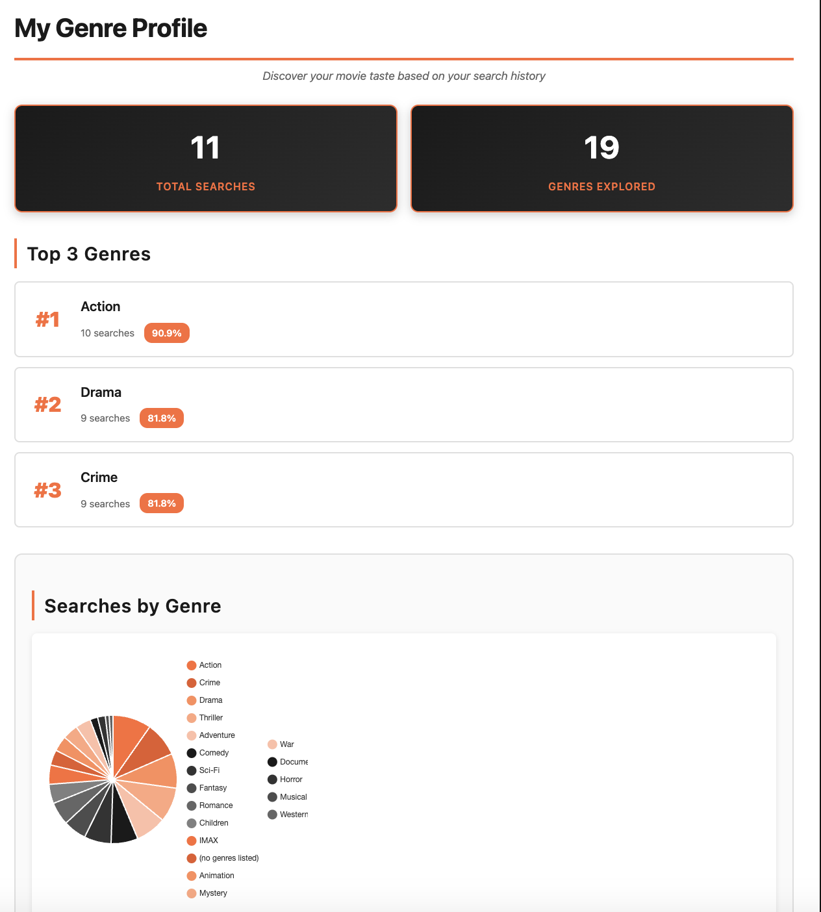
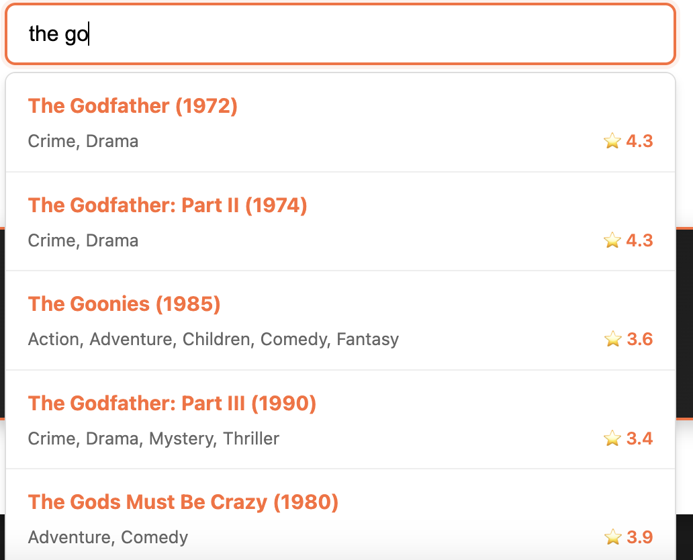

# MovieLens Explorer

A containerized Flask web application for exploring movie ratings and generating genre-based recommendations using the MovieLens dataset.

## 1. Executive Summary

I have often found myself struggling to understand the recommendation services on streaming platforms like Netflix, as these big brands make it surprisingly hard to find movies you’ll actually enjoy. They can sometimes drown users in long, endless lists and unclear “recommended” picks, which I’m never certain are for marketing purposes or actually generated from viewer rating. My solution offers a straightforward movie discovery tool built on real viewer ratings, helping people filter out low-quality titles and quickly find films similar to ones they already like. It supports fast searching, genre-based browsing, and visual insights like rating trends over time, making the experience a bit more personal and less overwhelming. It’s simple setup demonstrates how data and a clean interface can make movie selection a little easier and more informed for everyday users.

## 2. System Overview

This project demonstrates the following DS 2022 concepts:
- **Docker Containters** - Docker containerization for reproducible deployment
- **Serving APIs** - Flask REST API for data serving
- **Scripting Pipelines** - Automated data transformation and loading


Firstly, the project utilizes a Dockerfile container to package and deploy the app. The Dockerfile (which is summoned to be built by the run.sh file) is a text file that explains to the system how to build a Docker image. For this project, using a Dockerfile assures that Docker builds a base layer of the same Python version and dependencies used locally and copies data files so that paths are consistent, allowing the project to work on any machine. 

Secondly, this project uses a Flask App and Flask REST API endpoints to return JSON. Flask fits well for the small lightweight build of this project, as serve both full HTML pages and JSON-based REST API responses from the same backend, making it ideal for dynamic and interactive features like search and charts. It also integrates directly with pandas so it can process movie data in memory without requiring a full database.


Thirdly, this project uses an automated data pipeline. The file data_management.py runs at application startup. It performs the following functions: 
1. Loads Data: Reads raw csv files and creates pandas dataframes
2. Transforms Data: Converts unix timestamps (for readablity\), separates delimiters for genre, formats titles
3. Aggregates Data: Groups by MovieID and calculates average rating and rating count for each movie
4. Merging Data: Merges csv file data together and produces a unified dataset

The use of pandas data frames is very advantageous in this case, as the data provided is separated into different csv files that need to be merged and sorted according to the most relevant features and averages. An automated data pipeline allowed me to organize, clean, and use real-world data all with one command. It also includes error handling and progress logs in case something goes wrong in the process. 


### Architecture Diagram




### Data Source

**Dataset**: MovieLens Latest Small Dataset (this is the smaller version of a dataset describing ratings from MovieLens, a movie recommendation service)
- **Source**: [GroupLens Research](https://grouplens.org/datasets/movielens/)
- **Size**: 100,836 ratings across 9,742 movies (data generated by 610 users)
- **Format**: CSV files (movies.csv, ratings.csv)

**License**: Available for education and research purposes
**Citation**: F. Maxwell Harper and Joseph A. Konstan. 2015. The MovieLens Datasets: History and Context. ACM Transactions on Interactive Intelligent Systems (TiiS) 5, 4: 19:1–19:19.


## 3. How to Run (Local)

**Quick Start Command**

```bash
./run.sh
```

The `run.sh` script builds a Docker image for the MovieLens API, stops and removes any existing container with the same name, then runs a new container in detached mode on port 5000.


### Access the Application
- Web Interface: http://localhost:5000
- API Endpoints:
    - GET / - Home page with statistics
    - GET /movies - Browse popular movies
    - GET /movie/<id> - View specific movie details
    - GET /recommend/<id> - Get movie recommendations
    - GET /api/movies - JSON API for movies list
    - GET /api/movie/<id> - JSON API for movie details


### 4. Design Decisions

**Security Ops:** The app follows secure practices including environment-based configuration for sensitive settings: 
- Search terms are hashed before storage to protect user privacy.
- No personally identifiable information is collected or transmitted.
- All configuration uses os.getenv()  (No hardcoding)
- No passwords or API keys in code (Azure credentials stored in GitHub Secrets)


**Logs/Metrics:** The app uses a structured logging system built on Python’s logging module, with both console and rotating file handlers. Key events such as startup actions, user search queries, invalid inputs, file I/O issues, and route-level errors are recorded with log levels (such as DEBUG, INFO, ERROR, and WARNING). Logging behavior is fully configurable through environment variables. 

**Scaling and Limitations:** The current architecture works well for a small dataset (I used the smaller version from MovieLens) and light usage (minimal users), making it fully adequate for the scope of this project. Also, this project relies on in-memory data loaded from CSV files. 

While this is fine for the dataset size used here, supporting larger datasets, higher user traffic, and sensitive data would require additional components, such as a dedicated database and a better server. Running on Flask’s development server without authentication, caching, or scaling support also adds limitations to scalability and security. Additionally, the dataset itself is limited in range as well, as it only contains ratings up to 2018, meaning the system is lacking in more recent movie trends.

**The Tradeoff:** The app is designed to be simple and low-cost (small dataset, data loading practices, Flask deployment), which makes it easier to build and maintain for a class project. This does mean lower performance and limited scalability, but those tradeoffs are acceptable given the project’s small scope and single-user environment.


### 5. Results & Evaluation

**Screenshots**

**Home Page**

*The main landing page with search functionality and statistics*

**Movie Details Page**

*Movie information with star ratings, similar movies recommendations, and ratings over time chart*

**Genre Profile**

*User's genre analytics with pie chart and top 3 genres*

**Search Results**

*Live search results appearing as user types*


**Performance Notes**

- **Startup Time**: ~2-3 seconds to load dataset (ml-latest-small: 9,742 movies, 100,836 ratings)
- **Memory Usage**: ~50-100MB for in-memory data structures
- **Response Times**: 
  - Home page: <100ms
  - Movie details: <200ms
  - Search API: <150ms
  - Ratings over time: <300ms (includes CSV read)


**Validation/Tests Performed and Outcomes**


The automated smoke tests (tests/test_api.py) confirm that all core endpoints return successful responses and valid JSON where expected. 

*API Endpoints:*
-  {BASE_URL}/  —> Gets home page
- /movies —> Gets page with 50 most popular movies
- /movie/1  —> Gets movie detail page for movie ID 1
- /genre-profile —> Gets genre profile page 
- GET /api/movies —> JSON API for Popular movies list
- GET /api/movie/<id> —>  JSON API for movie details

The security validation automated in code (src/app.py) does the following:
*  The function sanitize_input(text, max_length=MAX_SEARCH_LENGTH) removes null bytes, controls characters, enforces length limits
* The function hash_search_term(search_term) hashes search terms with SHA256 before storage


### 6. What's Next 


**Planned improvements:** Code can be reorganized into clearer modules and services, with data access separated from routing logic. This code could also migrate from csv files to SQL for better performance and data loading/storage. Additional testing would also be necessary as the project grows. Future enhancements could include 
- More advanced recommendation models (going beyond just genre and implementing a user’s watch history and current movie trends), which would require better data management (using database such as SQL) and more advanced datasets (could possibly combine information from different movie datasets).
- Better analytics visualizations (which can be more personalized and insightful when generated among a backdrop of more user data, such as comparing results with other users)
- User-focused upgrades like watchlists or movie posters to enhance engagement


### 7. Links 

GitHub Repo Link: https://github.com/brewste/systemsproject.git

*Note: While i was originally working with another repo, I encountered errors with merging so switched to this new one, which is why most of the commits are more recent.*

Azure Cloud Link: https://movielensexplorer-c7hxgxaueth8h7df.canadacentral-01.azurewebsites.net 


## License and Acknowledgments

This project is licensed under the MIT License - see the LICENSE file for details.

MovieLens dataset provided by GroupLens Research


